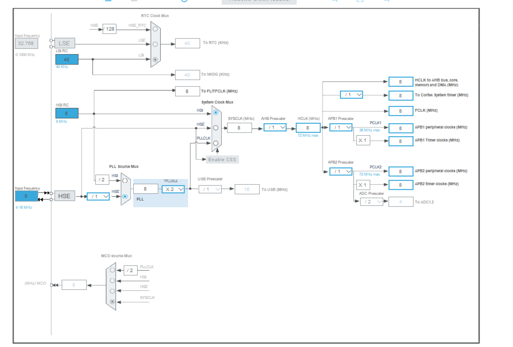
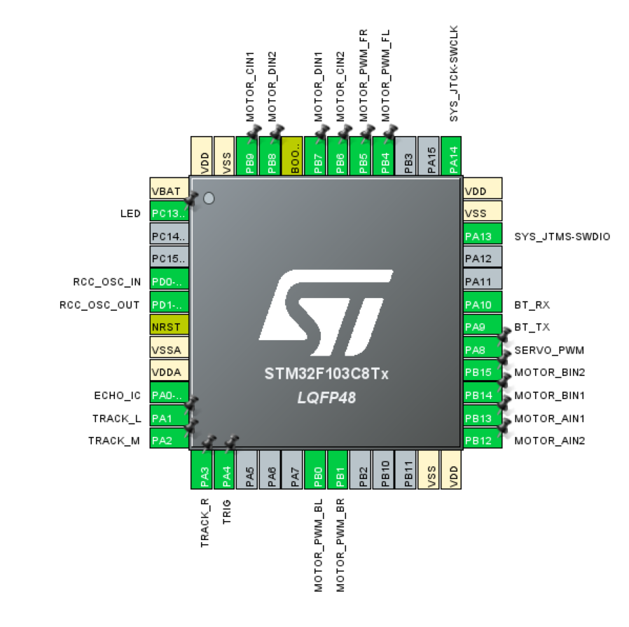

# 小车操作记录


## 1.物料准备，小车组装

组装看这个：https://b23.tv/9imD1eD

焊接看这个： https://b23.tv/enCJfMQ


## 2.项目结构

```
final_Project/  
├─ Core/                  // 核心代码、系统初始化（CubeMX 生成 + 自定义）  
│  ├─ Inc/                // 头文件目录  
│  │  ├─ main.h           // 主函数头文件（含全局宏、变量声明）  
│  │  ├─ stm32f1xx_hal.h  // HAL 库核心头文件（CubeMX 自动包含）  
│  │  ├─ stm32f1xx_it.h   // 中断函数声明（可自定义中断逻辑）  
│  │  └─ user_def.h       // 自定义全局变量、枚举、结构体（如小车状态）  
│  └─ Src/                // 源文件目录  
│     ├─ main.c           // 主逻辑：初始化、主循环（调度小车功能）  
│     ├─ stm32f1xx_it.c   // 中断服务函数（如定时器中断、串口中断）  
│     ├─ stm32f1xx_hal_msp.c // MSP 初始化（底层硬件映射：引脚、时钟、中断优先级）  
│     └─ system_stm32f1xx.c // 系统时钟、堆栈初始化（CubeMX 生成，一般不动）  
├─ Drivers/               // 外设驱动（CubeMX 生成 + 自定义封装）  
│  ├─ STM32F1xx_HAL_Driver/ // 官方 HAL 库源码（CubeMX 自动复制，含外设驱动）  
│  │  ├─ Inc/             // HAL 库头文件（如 stm32f1xx_hal_gpio.h、stm32f1xx_hal_uart.h）  
│  │  └─ Src/             // HAL 库源文件（如 stm32f1xx_hal_gpio.c、stm32f1xx_hal_uart.c）
/*----------------------------------------核心---------------------------------------------*/
│  ├─ BSP/                // 板级支持包（自定义外设封装，适配“小车硬件”）  
│  │  ├─ motor.h      // 电机驱动头文件：引脚宏、函数声明（如电机使能、调速）  
│  │  ├─ motor.c      // 电机驱动实现：调用 HAL 库操作定时器/PWM、GPIO  
│  │  ├─ track.h     // 循迹文件：如红外循迹、超声波测距的函数声明  
│  │  ├─ track.c     // 循迹实现：调用 HAL 库操作 ADC、定时器、串口  
│  │  ├─ obstacle.h     // 超声波避障文件：如红外循迹、超声波测距的函数声明  
│  │  ├─ obstacle.c     // 超声波避障实现：调用 HAL 库操作 ADC、定时器、串口
│  │  ├─ delay_timer.h         // 定时器延迟函数头文件
│  │  ├─ delay_timer.c         // 使用定时器中断，使延迟函数不阻塞程序进行
|  |  ├─ remote.h         // 蓝牙模块头文件：初始化、指令解析函数声明
|  |  └─ remote.c         // 蓝牙模块实现：UART 配置、指令接收处理 
/*----------------------------------------核心---------------------------------------------*/
└─ README.md              // 工程说明：硬件连接、功能说明、编译注意事项  
```

## 3.各项操作（cubeMX + keil5)

### 3.1.点亮小灯

用cubemx和keil5点亮stm32f103c8t6最小系统板的一个小灯来熟悉cubemx和keil5的各项操作

**1**.打开 STM32CubeMX。点击 File -> New Project，或者在主界面点击 ACCESS TO MCU SELECTOR

**2**.在 Part Number 搜索框中，输入 STM32F103C8T6，在下方的列表中选中它，然后点击右上角的 Start Project

**3**.在左侧的 System Core 中选择 SYS。在 Debug 下拉菜单中选择 Serial Wire。（可以防止锁芯片）这会启用 SWD 调试接口，会看到 PA13 和 PA14 引脚被自动配置为 SYS_SWDIO 和 SYS_SWCLK；

蓝丸板的板载 LED 连接在 **PC13** 引脚上。在右侧的芯片引脚图上找到 PC13。左键单击 PC13，在弹出的菜单中选择 GPIO_Output。此时 PC13 引脚会变为绿色。

配置时钟：选择外部时钟源，在左侧 System Core 中选择 RCC。在 High Speed Clock (HSE) 下拉菜单中选择 Crystal/Ceramic Resonator。这告诉系统我们使用开发板上的外部晶振（通常是 8MHz）。

配置系统时钟：切换到 Clock Configuration 标签页；在时钟树图中，将 Input frequency 设置为 8 MHz (如果不是默认值的话)。选择 HSE 作为 PLL Source Mux 的输入。在 HCLK (MHz) 的输入框中，直接输入 72 然后按回车。CubeMX 会自动计算出最佳的 PLL 分频和倍频系数，将系统时钟设置为最大频率 72MHz。



**5**.配置工程管理器：切换到 Project Manager 标签页。在 Project 子标签下：Project Name: 输入你的项目名称，例如 LED_Blink。Project Location: 选择一个存放工程的文件夹。Toolchain / IDE: **非常重要**，必须选择 MDK-ARM。（选择合适版本，我的keil5版本是V5.24，所以我选择V5.00）

在 Code Generator 子标签下：建议勾选 Generate peripheral initialization as a pair of '.c/.h' files per peripheral。这样生成的代码结构更清晰。

生成代码：点击右上角的 GENERATE CODE 按钮。生成完成后，会弹出一个对话框，点击 Open Project 直接用 Keil 5 打开工程。

**6**.keil烧录：先找到mian.c,找到操作的部分加入代码

配置下载器：点击菜单栏上的魔术棒图标 Options for Target。切换到 Debug 标签页。在右上角的下拉菜单中，选择 ST-Link Debugger。点击旁边的 Settings 按钮。在 Flash Download 标签页下，确保勾选了 Reset and Run；在 Flash Download 标签页下，确保勾选了 Reset and Run；点击 OK 保存设置

点击 Build (F7) 按钮（或菜单 Project -> Build Target）来编译代码。检查下方的 Build Output 窗口，确保没有 errors。

编译成功后，将 ST-Link 和开发板连接好并上电。

点击 Download (F8) 按钮（或菜单 Flash -> Download）将程序烧录到 STM32芯片中。

### 3.2系统基本配置和接线



键位：

1：循迹模式

2：避障模式

G：原地左旋

H：原地右旋

F：前进

L：左转

B：后退

R：右转

S：停止"# STM32IntelligentCar" 
